# IztaDB — Design and Implementation

**Design notes, architecture, and benchmark results for IztaDB, a Log-Structured Merge (LSM) key-value storage engine written in C++, inspired by LevelDB.**

---

## Table of Contents

- [Introduction](#introduction)
- [Why IztaDB and how does it compare vs. other alternatives](#why-iztadb-and-how-does-it-compare-vs-other-alternatives)
- [Architecture](#architecture)
  - [Overview](#overview)
  - [The Write Path](#the-write-path)
  - [The Read Path](#the-read-path)
  - [The Data Plane](#the-data-plane)
  - [WAL and Recoverability](#wal-and-recoverability)
  - [The SSTables](#the-sstables)
  - [The Full Read/Write Path](#the-full-readwrite-path)
- [Testing](#testing)
- [Benchmarking](#benchmarking)
  - [Main Benchmarks Takeaways](#main-benchmarks-takeaways)
- [Improvements and Future Work](#improvements-and-future-work)
- [Appendix A — Benchmark Details](#appendix-a--benchmark-details)
- [Appendix B — References](#appendix-b--references)

---

## Introduction

The amount of data collected has increased substantially given the advances in technology that have made it possible to store, process it and analyze it. In the past, traditional relational databases sufficed to keep track of the transactions of most businesses, however these pose limitations in terms of how efficiently they can be distributed and sometimes their isolation levels are too rigid in a world where for example durability isn't as important for some workloads. This gave rise to a new paradigm that encompasses all non-relational databases named no-SQL. It has been widely adopted with many advantages. No-SQL has many subclassifications within it including columnar stores, document databases, graph databases, etc. Each has its tradeoffs but they promise to organize data in a new matter.

Database systems are complex. They manage transactions, deal with concurrency and allow users to access and manipulate data. However at its core sits the storage engine, the heart that makes everything possible. I always had an interest in databases and wanted to learn more about how these 'black boxes' worked because thanks to abstraction today it's very simple for any user to learn how to interact with them, nonetheless I wanted to dig deeper and there was no better way to do so by building one, a mini-scale version of it and the storage engine was the best place to start this endeavor.

I chose to stick with the no-SQL databases because they are simpler to implement and distribute compared to traditional databases. I also have interest in learning more about distributed computing so it was the right choice for me and the first thing I did was start investigating and reading more. I have some background knowledge with databases. I've been working in the tech industry for three years as a database user. SQL is the declarative language I've used the most and had done some data engineering projects, however I wasn't literate in the database internals and while researching I finally understood that the so called tradeoffs are a consequence of the implementation details and decisions taken when building a storage engine.

---

## Why IztaDB and how does it compare vs. other alternatives

The name IztaDB is based on the Iztaccihuatl volcano in Mexico. In late 2025 I climbed it and it was an amazing experience, in fact it wasn't until the second attempt where I was able to reach the summit. When I did, it took about eight hours to reach the top and six to get back to base camp. It requires waking up early at 11:00PM (obviously I didn't sleep) before climbing it. The feeling of seeing central Mexico at 17,000 ft above sea level is amazing. It took many months of training and finally my hard work had paid off. It was a challenge to overcome and this project makes a tribute to this moment reminding me that these projects are like the mountains, hard but very fulfilling when conquered.

I was ready to commit and I decided to build a Log-Structured Merge (LSM) kev-value storage engine inspired by the LevelDB database. Compared to the traditional databases which use B+ trees to store information or sometimes using pointers towards the actual records, an LSM is an append-only engine. There are no updates or deletions. This has several advantages and the most important one is the ability to write quickly, sacrificing read speed since no data structure needs to be edited as new records are appended. B+ trees in contrast are very efficient at reading and updating but not so much writing because the nature of the trees is to stay balanced at all times. Modifications might trigger a rearrangement of the structure incrementing latency.

IztaDB, optimized for is very suitable for workloads where writing as fast as possible is required with a caveat that the data that's inserted doesn't exceed memory size because compaction is done in memory. Think of small devices that need to record events and after a certain amount of data is accumulated, it can be sent to a bigger server that stores the data long term. This makes sense in IoT devices or manufacturing sensors.

Even though reading is slow for IztaDB, several techniques that will be discussed later were built to improve read performance so looking for a specific record is possible if required by another subprocess. Another advantage of IztaDB is its durability promise. Before a record is inserted to the database it's stored in a Write-Ahead-Log (WAL) where it would persist in case of a crash.

LSM KV stores have been attempted by others, the industry standard is RocksDB, created and maintained by Meta as an open source project. However these solutions have a steep learning curve for its users but with all their fine tuning they have advanced significantly in the past years and are very efficient. My goal was making IztaDB as simple as possible. I've included extensive documentation in the codebase so users can understand what is happening. Even though there are some configurations a user can make such as the different thresholds which are adapted depending on the compute resources, these are no more than 5 so it's easy to set up and start using it. This is beneficial for budget constrained teams which don't have a big infrastructure team who can fine tune more sophisticated open source versions and don't require all of its capabilities.

To summarize, IztaDB is a database for workloads that need a storage engine that has durability guarantees, can adapt to the compute instance where it's run, can store everything in text for simplicity, write efficiency is the most important goal with a decent read speed for sporadic reads and is simple to implement.

---

## Architecture

### Overview

Following the LSM format, the storage engine contains many components interacting between them as transactions are executed. It's written in C++ to increase performance by managing memory manually. First there is an in-memory data structure named MemTable. Every single record starts as data stored in memory. The data structure used was the std::map in C++, it automatically sorts the data. Sorting although expensive is worth doing in this stage, because once data is flushed to disk, it's simpler to compact using a k-way merge algorithm. Before data is stored in the MemTable, data is written to the WAL. In case of a crash, data can be retrieved from the WAL and the MemTable is rebuilt. Checksums are applied to verify data wasn't corrupted.

The next stage are the Sorted String Tables or SSTables which are sorted tables written to disk. After the MemTable hits a certain threshold in the amount of records, it flushes the data to the SSTables. SSTables are ordered according to the order when they were written. For example, a SSTable named 0003.sst which has the highest number in the directory has the most recent data and it's where the Reader would start scanning when searching for a record. After a certain amount of tables are accumulated, all the data from the directory is loaded to an in-memory MemTable and flushed to a new temporary file, then the rest of the SSTables are deleted, getting rid of garbage accumulated.

To make use of abstraction the full codebase uses agents that have a limited scope on what they can do. This includes the MemTable agent for manipulating the MemTable, the LogReader and LogWriter which are responsible for updating the WAL, the SSTableReader and SSTableWriter which manipulate the SSTable files and finally IztaDB that acts as an orchestrator of the previous elements. This made testing simpler and simplified the building approach by tackling small tasks first before trying to make everything interact.

### The Write Path

All inserted records pass through the process shown in Figure 1. It applies for both get and remove records. Since this is an append-only engine, records are structs which contain the value in case it's a live record or an empty record if it was deleted. Enums identify the type of record.

SSTables numbering system helps keep track of which is the most recent data as previously stated and is used for the compaction routine where the map data structure eliminates duplicate records reducing the required disk space, for this version compaction reused the code components previously built and only added a method that scans all records from each of the SSTables and inserts it into a MemTable. It starts from the first flushed SSTable table up to the last one so the most recent record overwrites the oldest one. After all data is in the MemTable it is flushed to a temporary file, and then the old SSTables are deleted. The process restarts and repeats again.

This system keeps an accurate history of records explained in the following example. Let's assume a record was deleted and then resurrected, it has the same key but the enum of the record struct changes from TOMBSTONE to VALUE.

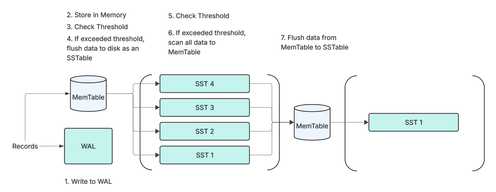

**Figure 1.** The Write Path

### The Read Path

The read path is shown in Figure 2. The first step is to look into the MemTable. If the record isn't found there, then the engine will scan each SSTable. The worst case (when a record wasn't found) would be to scan the full table.

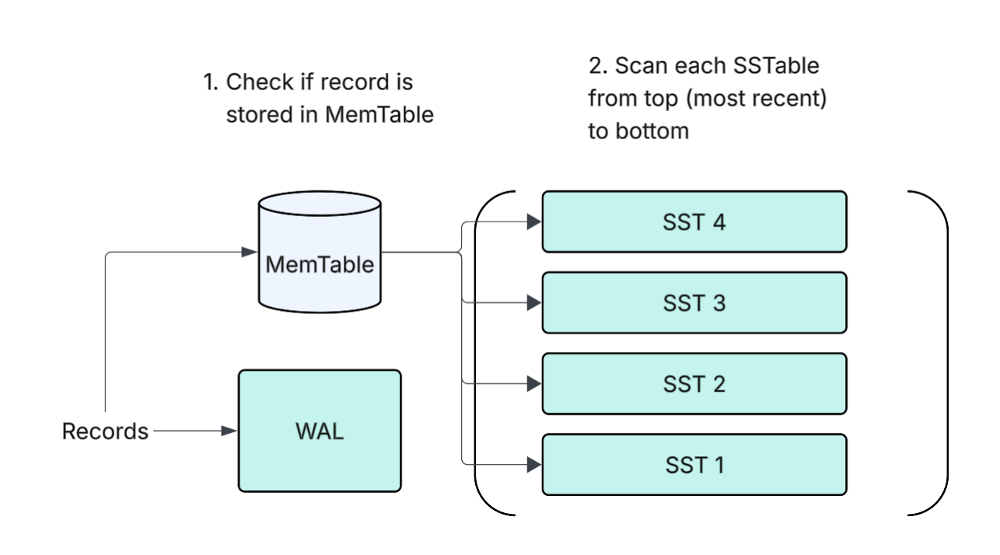

**Figure 2.** The read path

### The Data Plane

When writing data to disk, binary files were used because it proved to be simpler to search for data using byte offsets and increasing performance. The two disk writes in the platform are the WAL and the SSTables. Checksums are calculated and written on disk in order to guarantee the reader that the data wasn't corrupted. To do this the CRC32 algorithm (optimized at the hardware level and used by RocksDB) was used for each WAL record and each of the SSTable blocks. When a read agent would try to retrieve information from disk and a potential record was found, the agent before returning the data checks if it matches the checksum. The probability of collision is in the billionth fraction so it's almost 100% accurate that a different checksum means data was corrupted or truncated. IztaDB sends an exception error so the administrator can investigate the issue and reboot if necessary.

### WAL and Recoverability

Each WAL record has the same format. It consists of a struct (see Figure 3) that contains a sequence number which increases for each record, a checksum using the algorithm CRC32, the record type (if it's a value or tombstone record) and the actual key and value. Notice that the length for both the key and value are fixed. This limits the number of characters a user can write to keys and values. To prevent performance degradation from the WAL a threshold exists so WAL records are stored in different files. And when the MemTable is rebuilt from WAL, it scans through each of these files.

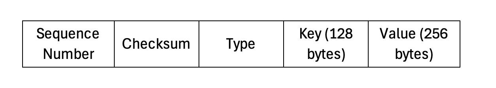

**Figure 3.** the WAL Record struct.

Every time a new instance of IztaDB is created the first step is to check whether data exists in the WAL. If it finds data in the directory, the immediate step is replaying the data from the WAL and inserting it into the MemTable. If the WAL path is empty it builds a fresh MemTable.

### The SSTables

SSTables has three main components (See Figure 4). First, there are the data blocks. These contain the actual records and in comparison with the WAL records, have variable key and value sizes in order to reduce space and improve read performance. Records contain the length of the keys and values to correctly move between them and the type of transaction. After all records are stored, the block 'is closed' by inserting a checksum used on the read path to verify data is uncorrupted, this happens when the block size threshold is reached. The default set is 4KB, which RocksDB uses as its minimum. Secondly, in parallel when closing a block a sparse index is created to access blocks and reduce search time. Each index contains the last key of the data block, its length, the block offset relative to the start of the file and its size in bytes. Finally at the end of the file a footer exists, this indicates where the sparse indexes start using an offset and has a fixed magic value, in this case it's the bytes for 'IZDB' which guarantees data isn't corrupted.

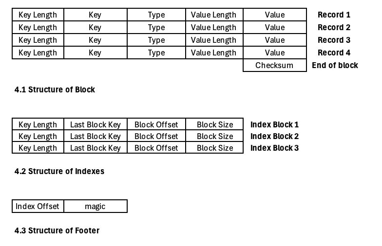

**Figure 4.** Anatomy of an SSTable.

### The Full Read/Write Path

After giving more context on how the SSTables are conformed, it's clear that the write path is tracking when flushing from the MemTable to the SSTables sizes of the keys, values, creating a checksum and for each block adding an index. At the end of each SSTable a footer is added and this will aid in understanding how the read path works with finer detail.

The first step is verifying the magic number, since all footers have the same fixed size it's simple to extract both elements including the magic number and then the index offset by subtracting the file size to this fixed footer size. After verifying the magic number is correct, the cursor jumps to the byte where the indexes start and scans all of them adding them to a list using a struct. While parsing each index, it uses the key length to know how many bytes to jump to find the last key value. It then records the block offset and the block size repeating the process until all indexes are loaded as an attribute of the SSTableReader agent.

Once a get request it's triggered it can scan using a binary search type of algorithm from std named lower_bound in which a target key is compared vs. the last key. It first lands in the middle of all the keys and compares if last key < target, if true then it means it's definitely not on the left side, it discards all the keys there and immediately repeats the process on the remaining right keys until it reaches the candidate block for it to scan. It can be the case that no such example exists and it returns null instead.

When a candidate block is found it can scan all of its contents. Given that the index block contains the record offset, it can move the cursor to where the block starts and start scanning all of the records using from each the key and value length to move across the records. If a match is found it checks if it's an active value or a tombstone and returns the result. As previously mentioned this process starts in the most recent SSTable which has the freshest data and if no record was found it will switch to the next SSTable until it reaches the end of the directory. Not finding a record in any SSTable means it was never written and a null is also returned in these scenarios.

Using sparse indexes reduced latency and the need for large memory to store them because it's divided in blocks instead of dense indexes which need one index per record. Since the sorting price was paid when records were inserted to the MemTable, using binary search is possible. The naive approach would be to scan linearly all the SSTables significantly degrading performance when the data on disk grows.

---

## Testing

To verify each agent and the overall database was built correctly every single class was extensively tested. The suite used was Google Test covering more than 120 tests. The benefit of this test suite is that it allows setting up for each test so it would start in a blank state and be applied to different scenarios. Edge cases were tested extensively. Most of the tests consist of verifying the correct rotation of the files names, corrupting and truncating data to see if the engine would detect it, adding randomness when executing some actions such as deletions, verifying the attributes when agents were constructed and understand how it behaves under non-wanted behaviors.

Testing helped understand more about the durability of data and identified some weaknesses. For example the current database isn't capable of detecting if a WAL file was truncated and the exact point where it was truncated was exactly between records. To solve this problem an end of record struct was added to each WAL file. This solved the issue for intermediate files but for the latest WAL files it is unclear if data was truncated.

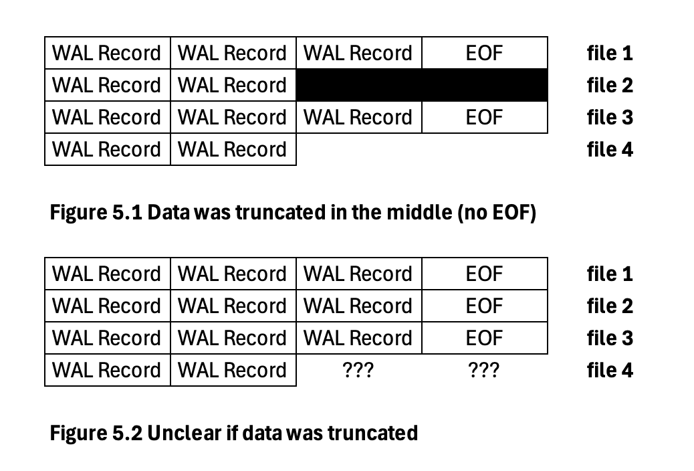

**Figure 5.** Durability limitations

---

## Benchmarking

Measuring performance of the storage engine was one of the most important sections of the project. These will guide the next steps and aid in the understanding of how it is working compared to RockDB, the other database we compared them. A full analysis for each benchmark can be found in Appendix A.

It was complex, making a direct comparison with RocksDB. These was their setup on AWS:

Instance type: m5d.2xlarge 8 CPU, 32 GB Memory, 1 x 300 NVMe SSD.

Kernel version: Linux 4.14.177-139.253.amzn2.x86_64

File System: XFS with discard enabled
Keys: 900M
Cache size: 6GB
Default parameters

Building a one to one replica to the benchmarks of RocksDB wasn't possible. The database is very complex and has been tuned for more than a decade. Reading and understanding the code wasn't in the scope of the project and if a closer look is taken into the setup numbers for their benchmarks, it's clear they are showcasing numbers to simulate real production. IztaDB benchmarks aren't at that scale and instead it's run in a laptop with limited RAM and orders of magnitude of different keys. However, it is still possible to make comparisons from some tests of IztaDB while evaluating the architecture of RocksDB and see if IztaDB was on the right path towards a production grade engine. The purpose is not making an exact replica but understanding if it's working according to the expected behavior and if not what should be added in future.

When testing the benchmarks variance was checked. They had to be run at least two times in order to get reliable numbers with single digit variances

### Main Benchmarks Takeaways

After extensively benchmarking IztaDB, these were the most important discoveries:

1. Space amplification was drastically reduced after compaction. This follows from benchmark 10, the uncompacted result hit 12x space amplification vs. RocksDB 5x-9x rate. After compaction the result was significantly reduced and it stopped growing linearly, reducing latency as more duplicate keys are added. Currently compaction is done in-memory so the performance of the database is bounded by the RAM size.

2. MemTable read had the closest match to RocksDB, IztaDB is more stable here and slight improvements could be useful but not necessarily urgent as this is more than enough. For the SSTables in contrast bloom filters are necessary and/or a block cache because forcing to scan a block is costly if repeated.

3. Unrestricting the key and value sizes is necessary because it doesn't affect latency, as value size grows it follows a logarithmic trend vs. linear. This will also reduce the write latency.

---

## Improvements and Future Work

IztaDB could be used in production today and it would hold on to its promises, however as it was explored during the testing and benchmarking phases there are many improvements for the current codebase:

- Reduce the write time, instead of calculating the write path by scanning the WAL directory each call to the LogWriter, experiment having a variable in-memory and only recalculate when completely necessary (once the threshold was exceeded). Related to this, build checksums for each WAL file instead of each record, reducing the amount of times a checksum is calculated.

- Add bloom filters: this is vital to reduce the time it takes to scan a full block. These prevent it by guaranteeing that a record is not inside the block. In the scenario where a record isn't inside any SSTable it will omit all indexes and won't scan unless necessary.

- Build a leveled compaction algorithm on-disk. Currently IztaDB depends on the size of RAM for it to compact the SSTables, if the database exceeds this capacity it will stop working. To prevent this the new compaction algorithm seen in LevelDB will compare on disk using a k-way merge algorithm. Adding the older records to higher levels. A Manifest file to keep control of the growing files needs to be added tracing the changes to the levels.

- Make the key and value sizes unrestricted, currently the WAL has a restriction in the sizes and it's limiting for workloads that require more characters. It's an easy fix that resembles the records structure of the SSTables.

- Dig deeper into durability of similar storage engines, what are their policies and given its current capabilities, let the user pick the durability guarantees.

- Experiment with a block cache layer. This can help speed up fresher data for workloads that need quick access. Understand how RocksDB uses cache under the hood and use that as inspiration for IztaDBs implementation.

- Create a concurrency protocol for the database. Currently its single threaded but if it's main purpose is for it to be used by sensors or especially IoT devices, multiple writes and reads might be required, most databases have this implemented and it would expand its use cases, this includes a networking layer so it can be accessed remotely.

- Expand the benchmarks on different instances, renting more powerful instances on a cloud provider to increase RAM and inserting millions of rows to measure when performance starts degrading and make adjustments based on the results.

---

## Appendix A — Benchmark Details

### Benchmark 1. Cold Put

**Description:** Puts one record to the MemTable, no cache warmup.

**Set Up**

MemTable Threshold: 1M records
WAL Size file: 32MB
Size: 5K kv pairs.
Block Size: 4KB
Keys: key_000000000000, key_000000000001, etc.

Values: All are 'X' * 100

**Result and Analysis**

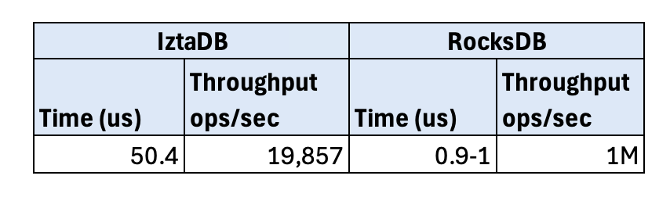

**Table A1.** IztaDB vs. RocksDB Put Operation to MemTable

The order of magnitude is around 20x compared to RocksDB. The reason the read path is slower is that each call to write updates the sequence number and recalculates the correct write path. Time could be slashed around 50% if this operation is removed and more improvements could be implemented. As a note RockDB has been tuned heavily over the years so a closer look into their architecture could reduce the time it takes to write to memory. The WAL is also part of the bottleneck and an improvement could be to do only one checksum per WAL file vs. one per record.

### Benchmark 2. Put Across Flush

**Description:** Puts one record to the MemTable, and measures the time it takes to flush.

**Set Up**

MemTable Threshold: 100 records
WAL Size file: 32MB
Size: 50 trials, 150 keys per trial so the flush threshold trigger is executed once.
Block Size: 4KB
Keys: key_000000000000, key_000000000001, etc.

Values: All are 'X' * 100

**Results and Analysis**

To verify that the results were accurate, two different stages were measured. Regular record operation time vs. flush. For non-flush operations the P99 tail was 98.17 us. However in the next graph one can see that flush operations took significantly longer than the non-flush records, even the flush record minimum is significantly larger than the P99 for non-flush. As expected, flushing the MemTable takes more time vs. a standard put to the MemTable.

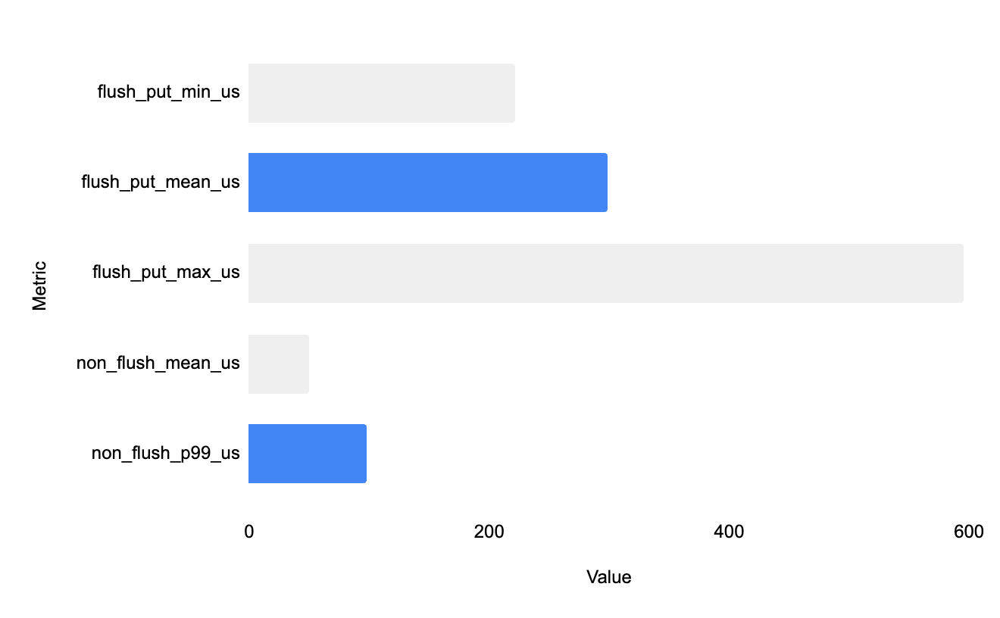

**Graph A2.** Flush vs. non-flush latency

Compared to RocksDB, their P99 is 10k us. Even though this is about 30x more than IztaDB, the reason it takes significantly more is that RocksDB is operating at peak performance with 900M keys, compacting at multiple levels and using a specific MemTable tuning. These conditions make RocksDB take significantly more time. If the workload diminished, it's likely the numbers would be on par with IztaDB or even lower because of its performance, either way it's a good signal that IztaDB is operating with significantly lower latency.

### Benchmark 3. Hit in MemTable

**Description:** Executes a get operation to the MemTable for each key.

**Set Up**

MemTable Threshold: 1M records
WAL Size file: 32MB
Size: 5K KV pairs.
Block Size: 4KB
Keys: key_000000000000, key_000000000001, etc.

Values: All are 'X' * 100

**Result and Analysis**

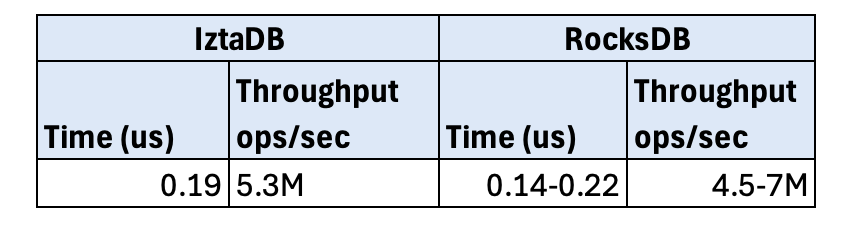

**Table A3.** IztaDB vs. RocksDB Get operation MemTable

This result is comparable in orders of magnitude. Despite RocksDB being run on multi-threads over more records, IztaDB fell inside this range. This is likely due to the fact that it is simply accessing memory and the speed comes from the chosen data structure. There could be some improvement in this operation experimenting with a different data structure such as a skip list used by LevelDB or adding a cache layer.

### Benchmark 4. Hit in Single SSTable Warm

**Description:** Executes a get operation to the first SSTable for each key.

**Set Up**

MemTable Threshold: 1M records
WAL Size file: 32MB
Size: 5K KV pairs.
Block Size: 4KB
Keys: key_000000000000, key_000000000001, etc.

Values: All are 'X' * 100

Before executing the get operation, data is warmed in cache by running the get command once for each key in order to simulate real production where time for CPU set up is more variable. Warming up causes the results to be more predictable. This setup was done for other benchmarks and will be indicated in the Set Up section.

**Result and Analysis**

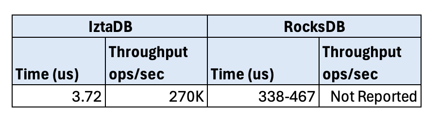

**Table A4.** IztaDB vs. RocksDB Get operation single SSTable

IztaDB is faster here by 100x, however this isn't a fair comparison, inserting millions of keys to the database and having 6GB of cache as a setup isn't the same so it can't reliably be known how much this change would be if the sample was smaller for RocksDB. Either way, the scan result of a single block would likely be similar because there is no escaping of scanning a block which is what this test is addressing. To optimize this part the observed solution would be adding a cache layer, however this might not be enough for all situations so it can be flagged as a lower priority.

### Benchmark 5. Get Oldest Key (Worst Case Scan)

**Description:** This benchmark tests retrieving the oldest key from IztaDB forcing the scan of each SSTable, different directory sizes are tested (in terms of the number of SSTables).

**Set Up**

MemTable Threshold: 100 records.
WAL Size file: 32MB
Compaction Trigger: 10 files, 0 for non-compaction benchmark
Size: 100 KV pairs per SSTable, [1, 2, 4, 8, 16, 32] file size.
Block Size: 4KB
Keys: key_000000000000, key_000000000001, etc.

Values: All are 'X' * 100

Warm-up cache

**Result and Analysis**

No direct test exists for RocksDB. What this test was useful for was showing the importance of compaction. If one takes a look into the graph below, without compaction time to look into data scales linearly. Once compaction was implemented, latency was significantly reduced and stayed linear. RocksDB also uses compaction and a similar behavior would be expected from it with less latency because it has bloom filters.

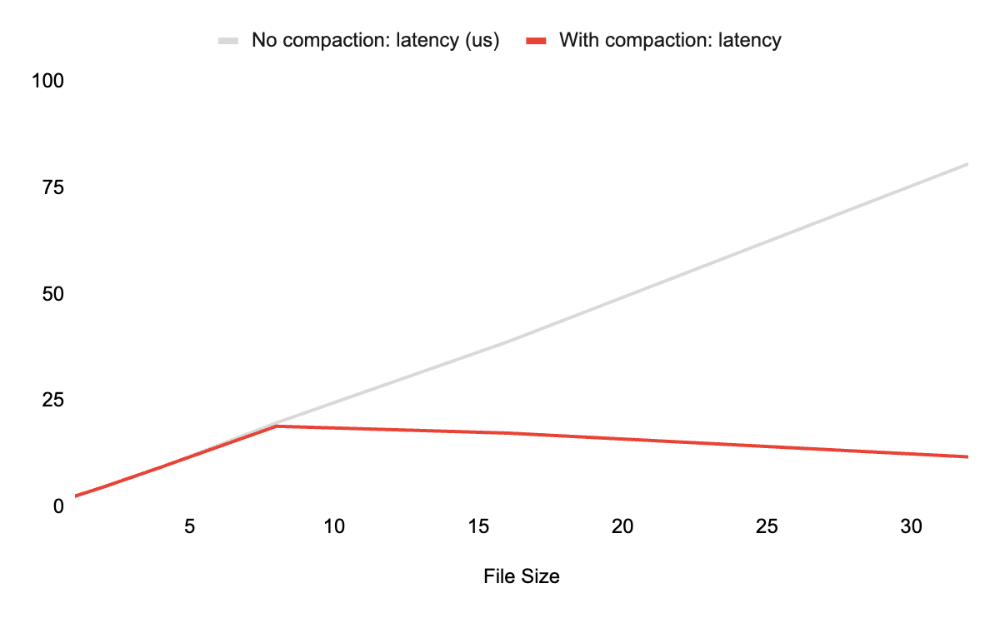

**Graph A5.** Latency (us) vs. file size when adding compaction

### Benchmark 6. Get Missing Key

This benchmark is practically the same as Benchmark 5 with a small twist, the data it's looking for doesn't exist in any SSTable but it uses as the look key 'aaa_never_inserted' so it's forced to scan at least one block and scan all the SSTables. The results are practically the same compared to Benchmark 5. (See graph below).

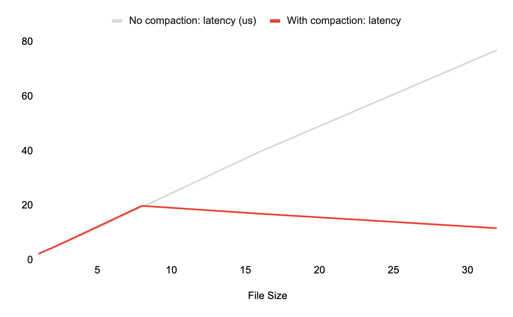

**Graph A6.** Latency (us) vs. file size when adding compaction

### Benchmark 7. WAL restart (recovery time)

**Description:** Measures how long it takes IztaDB to restart the MemTable after it crashes. Data is populated to the WAL and IztaDB is deleted and constructed again.

**Set Up**

MemTable Threshold: 10M
WAL Size file: 300 records per file (adds more files to WAL)
Size: 2, 6, 24, 96 files per directory.
Block Size: 4KB
Keys: key_000000000000, key_000000000001, etc.

Values: All are 'X' * 100

**Result and Analysis**

As seen in the results graph below, data has a linear trend, the more files, the longer it takes for WAL to restore. RocksDB didn't record this in its benchmarks, this is a predictable linear trend and it would be hard to reduce the time because there is no WAL compaction, every single record that gets inserted to the MemTable is added in parallel to the WAL.

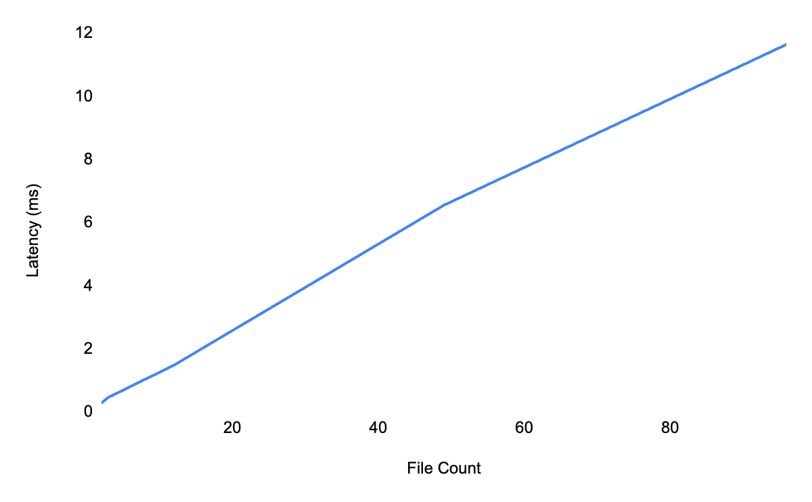

**Graph A7.** Latency (ms) vs. file size of WAL recovery

### Benchmark 8. CRC32

**Description:** Checks how much time it takes to calculate the checksum using the CRC32 algorithm. No setup is required, simply getting data from the function and building a 4KB buffer.

**Result and Analysis**

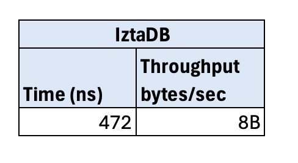

**Table A8.** IztaDB performance of CRC32

CRC32 is used as well by RocksDB and it is dependent on the hardware of the instance where it runs. Not much can be done to optimize the algorithm. What can be modified is how often to apply the algorithm as seen with the WAL records where it is applied for each record. It does take some time to execute and it adds up the more times it's called even if it's useful, it comes with a cost.

### Benchmark 9. Put and get vs. value size

**Set Up**

MemTable Threshold: 10M (Isolate put time from flush)
WAL Size file: 32MB
Size: 2, 6, 24, 96 files per directory.
Block Size: 4KB
Keys: key_000000000000, key_000000000001, etc.

Values: All are 'X' * 100

**Description:** Tests different value sizes from 8 to 256 and tests if latency increases while executing a put or get operation.

**Result and Analysis**

This test wasn't reported on the RocksDB repository. For the put operation, as expected given that all keys and values have the same bytes in size, there was no difference in the latency (see graph B9.1). Hence, this limits performance because even a KV pair of one byte has the same latency as one that has 256. Compare this to the get operation where a slight trend upwards can be observed (see graph B9.2). The growth is around 16% from 2 to 256 bytes. There was always some noise when the tests were run because of flushing but 256 tended to be higher. This means value size doesn't make latency grow linearly so unrestricting the value and key is the right move for the improvements.

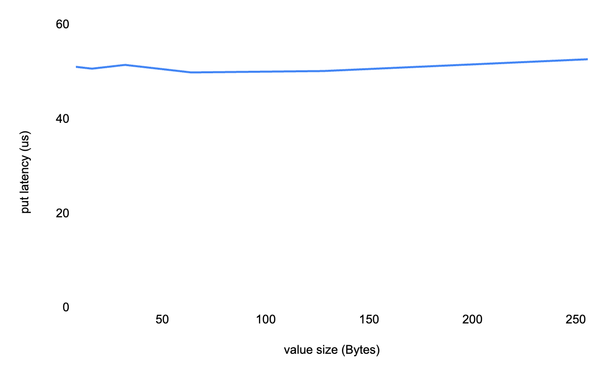

**Graph A9.1.** Put Latency (ms) vs. value size

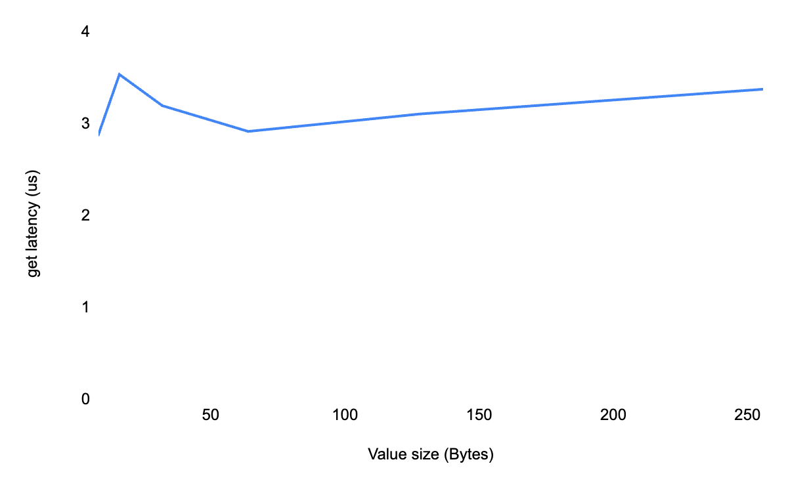

**Graph A9.2.** Get Latency (ms) vs. value size

### Benchmark 10. Space Amplification

**Description:** Writes 20 'live' KV pairs that will never be replaced or deleted so the database size is never zero and generates garbage instantly inserting keys and immediately deleting them so it grows (each of these actions is named a churn cycle). Compares the difference between compaction and no compaction.

**Set Up**

MemTable Threshold: 20 records (so all live keys are flushed to SSTable)
Live KV pairs: 20
Compaction Trigger: 10 files, 0 for non-compaction benchmark
Size: Churn Cycles Number of put + delete pairs: 50, 100, 200, 400, or 800
Block Size: 4KB
WAL size: 32MB
Values: All are 'X' * 100
Keys: anchor_000000000000 for live keys and churn_000000000000 for garbage

**Result and Analysis**

After compaction was implemented it is clear that reducing the size of garbage drastically reduced latency and it stabilized this. Even though a direct benchmark doesn't exist for RocksDB, it implements compaction as well. This graph proves the importance of compaction: a constant stable trend is the goal is preferred to a linear increase in latency. It is important to develop an on-disk compaction algorithm so the limitation isn't RAM size.

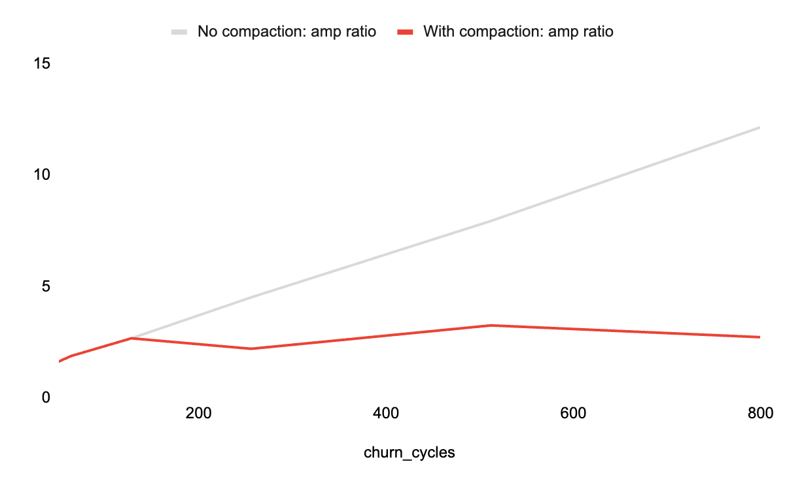

**Graph A10.** Write Amp Ratio (Total Disk Bytes / Live Bytes (Non-garbage)) vs. churn cycles

---

## Appendix B — References

### Main References

1. Facebook (Meta) Open Source. RocksDB. GitHub repository, ongoing. https://github.com/facebook/rocksdb

2. Google. LevelDB. GitHub repository, ongoing. https://github.com/google/leveldb

3. Kleppmann, M., & Riccomini, C. (2026). Designing Data-Intensive Applications: The Big Ideas Behind Reliable, Scalable, and Maintainable Systems (2nd ed.). O'Reilly Media. ISBN 978-1-098-11905-8.

4. Petrov, A. (2019). Database Internals: A Deep Dive into How Distributed Data Systems Work (1st ed.). O'Reilly Media. ISBN 978-1-492-04034-7.

5. Garcia-Molina, H., Ullman, J. D., & Widom, J. (2009). Database Systems: The Complete Book (2nd ed.). Pearson/Prentice Hall. ISBN 978-0-13-187325-4.

### Benchmark References

- Facebook (Meta). *RocksDB In-Memory Workload Performance Benchmarks*. GitHub wiki. [https://github.com/facebook/rocksdb/wiki/RocksDB-In-Memory-Workload-Performance-Benchmarks](https://github.com/facebook/rocksdb/wiki/RocksDB-In-Memory-Workload-Performance-Benchmarks)

- Facebook (Meta). *RocksDB Performance Benchmarks*. GitHub wiki. [https://github.com/facebook/rocksdb/wiki/Performance-Benchmarks](https://github.com/facebook/rocksdb/wiki/Performance-Benchmarks)
